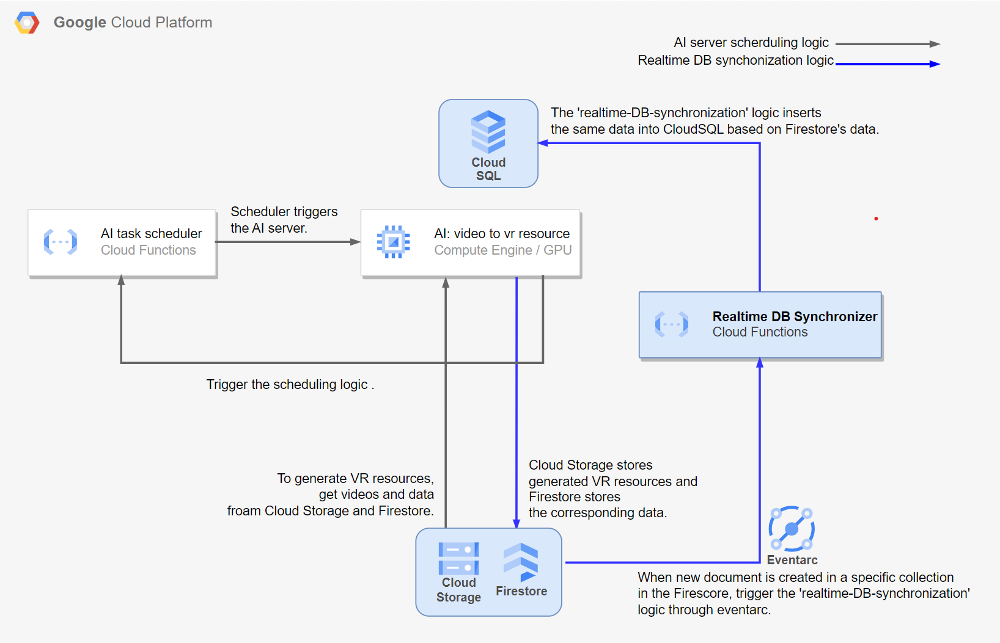

## 🔎 Overview

It is responsible for synchronizing between Firestore and CloudSQL. When the AI server stores its result in Cloud Storage and Firestore, instant synchronization takes place from Firestore(sub DB) to CloudSQL(main DB).

## 🛠 Architecture

## ❓ Why did you use this seperate logic?

It's because we want a loosed dependency between gateway server and AI server. To update CloudSQL on the gateway server based on Firestore's data, gateway server had to receive from the AI server that the task was finished (except polling). But we want only the client side send request to the endpoint API of the gateway server.

Therefore, we added a separate logic to the infrastructure, allowing synchronization between Firestore and CloudSQL to occur automatically.
